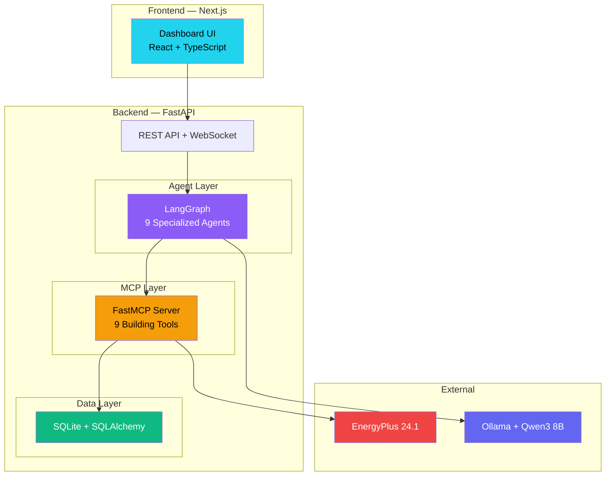
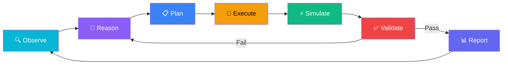

<p align="center">
  <h1 align="center">🏢 Eco-Loop Building Agents</h1>
  <p align="center">
    <strong>Autonomous Closed-Loop Building Optimization with AI Agents</strong>
  </p>
  <p align="center">
    EnergyPlus • LangGraph • MCP • Qwen3 8B • FastAPI • Next.js
  </p>
</p>

<p align="center">
  
  
  
  
  
</p>

---

> **Implementation status: Phase 1 complete** (see `phases.md`). Backend
> (FastAPI + SQLite + SQLAlchemy) and frontend (Next.js + TS + Tailwind)
> are runnable now, using mock EnergyPlus/Ollama/LangGraph/FastMCP services
> behind the same interfaces the real integrations will use later
> (`USE_MOCK_ENERGYPLUS` / `USE_MOCK_LLM` in `.env`).

## 🚀 Quick Start (Phase 1)

**Backend**
```bash
cd backend
python -m venv venv && source venv/bin/activate   # Windows: venv\Scripts\activate
pip install -r requirements.txt
uvicorn app.main:app --reload
```
Runs at `http://localhost:8000` (Swagger docs at `/docs`). `backend/.env`
already ships with both mock flags on — nothing external to install.

**Frontend**
```bash
cd frontend
npm install
npm run dev
```
Runs at `http://localhost:3000`, proxying `/api/*` to the backend.

---

## 📋 Table of Contents

- [Overview](#-overview)
- [Problem Statement](#-problem-statement)
- [Architecture](#-architecture)
- [Tech Stack](#-tech-stack)
- [Folder Structure](#-folder-structure)
- [Prerequisites](#-prerequisites)
- [Installation](#-installation)
- [EnergyPlus Setup](#-energyplus-setup)
- [Ollama Setup](#-ollama-setup)
- [Database](#-database)
- [MCP Tools](#-mcp-tools)
- [LangGraph Agents](#-langgraph-agents)
- [Dashboard](#-dashboard)
- [API Reference](#-api-reference)
- [Closed-Loop Flow](#-closed-loop-flow)
- [Development Roadmap](#-development-roadmap)
- [Future Work](#-future-work)
- [License](#-license)

---

## 🌍 Overview

**Eco-Loop Building Agents** is an autonomous closed-loop building energy optimization system that combines:

- **EnergyPlus 24.1** — DOE's gold-standard building energy simulation engine
- **Qwen3 8B Instruct** — Open-source LLM running locally via Ollama
- **LangGraph** — Multi-agent orchestration framework
- **FastMCP** — Model Context Protocol for standardized tool calling
- **Next.js Dashboard** — Enterprise-grade real-time monitoring

The system continuously **observes** building conditions, **reasons** about inefficiencies, **plans** optimizations, **executes** changes through MCP tools, **simulates** outcomes via EnergyPlus, **validates** safety, and **repeats** — all autonomously without human intervention.

---

## 🎯 Problem Statement

> **Build an autonomous closed-loop building optimization system using EnergyPlus, an open-source LLM, MCP tool calling, and AI reasoning.**

Buildings consume **40% of global energy**. Most building management systems (BMS) use simple rule-based controls that can't adapt to changing conditions. Eco-Loop demonstrates how AI agents can:

1. **Reduce energy consumption** by 15-30% through intelligent setpoint optimization
2. **Maintain occupant comfort** within ASHRAE 55 standards
3. **Lower carbon emissions** proportionally to energy savings
4. **Operate autonomously** without human intervention
5. **Run completely offline** using a local open-source LLM

---

## 🏗️ Architecture

### High-Level System Architecture



### Closed-Loop Flow



📖 **Detailed architecture docs**: [docs/architecture.md](docs/architecture.md)

---

## 🛠️ Tech Stack

| Layer | Technology | Purpose |
|---|---|---|
| **Backend** | Python 3.11+ / FastAPI | REST API, WebSocket, async processing |
| **Frontend** | Next.js 14 / React 18 / TypeScript | Dashboard UI |
| **Styling** | TailwindCSS / shadcn/ui | Enterprise dark theme with glassmorphism |
| **Charts** | Recharts | Interactive data visualizations |
| **Animations** | Framer Motion | Smooth transitions and micro-animations |
| **Database** | SQLite / SQLAlchemy / Alembic | Persistent storage with migrations |
| **Simulation** | EnergyPlus 24.1 / eppy | Building energy simulation |
| **LLM** | Qwen3 8B Instruct / Ollama | Local AI reasoning |
| **Agents** | LangGraph | Multi-agent orchestration |
| **MCP** | FastMCP / langchain-mcp-adapters | Standardized tool interface |
| **Containers** | Docker / Docker Compose | Reproducible environment |
| **CI** | GitHub Actions | Automated testing |

### Why Qwen3 8B Instruct?

| Criterion | Detail |
|---|---|
| **Quality** | Best-in-class at 8B scale — outperforms Llama 3.1 8B on reasoning benchmarks |
| **Tool Calling** | Native function calling support via Ollama |
| **Latency** | ~3s per response on RTX 3060 |
| **Memory** | ~5GB VRAM (GPU) or ~8GB RAM (CPU) |
| **License** | Apache 2.0 — fully permissive |
| **Offline** | Runs 100% locally via Ollama — no API keys needed |

📖 **Detailed justification**: [docs/llm.md](docs/llm.md)

---

## 📁 Folder Structure

```
AI-Agent/
├── backend/                    # Python FastAPI backend
│   ├── app/
│   │   ├── main.py             # FastAPI entrypoint
│   │   ├── config.py           # Settings management
│   │   ├── database.py         # SQLAlchemy setup
│   │   ├── api/routes/         # REST API endpoints
│   │   ├── models/             # SQLAlchemy ORM models
│   │   ├── schemas/            # Pydantic validation schemas
│   │   ├── services/           # Business logic
│   │   ├── agents/             # LangGraph agent definitions
│   │   ├── mcp/                # FastMCP server & tools
│   │   └── core/               # Logging, exceptions
│   ├── alembic/                # Database migrations
│   ├── tests/                  # Backend tests
│   └── requirements.txt
├── frontend/                   # Next.js dashboard
│   ├── src/
│   │   ├── app/                # Next.js App Router pages
│   │   ├── components/         # React components
│   │   ├── lib/                # API client, utilities
│   │   ├── hooks/              # Custom React hooks
│   │   └── types/              # TypeScript definitions
│   └── package.json
├── energyplus/                 # Simulation files
│   ├── models/                 # IDF building models
│   └── weather/                # EPW weather files
├── docs/                       # Documentation
│   ├── architecture.md         # System architecture
│   ├── energyplus.md           # EnergyPlus deep-dive
│   ├── database.md             # Database schema & ER diagram
│   ├── mcp.md                  # MCP tools & integration
│   ├── agents.md               # Agent graph & prompts
│   ├── dashboard.md            # Dashboard design & wireframes
│   ├── llm.md                  # LLM selection & setup
│   ├── closed-loop.md          # Closed-loop flow
│   └── api.md                  # API reference
├── docker/                     # Docker configuration
├── .github/workflows/          # CI/CD
├── .env.example                # Environment template
├── .gitignore
├── LICENSE
└── README.md
```

---

## 📦 Prerequisites

Before installation, ensure you have:

| Software | Version | Purpose | Installation |
|---|---|---|---|
| Python | 3.11+ | Backend runtime | [python.org](https://python.org) |
| Node.js | 20+ | Frontend runtime | [nodejs.org](https://nodejs.org) |
| EnergyPlus | 24.1.0 | Building simulation | [energyplus.net](https://energyplus.net) |
| Ollama | Latest | Local LLM runtime | [ollama.com](https://ollama.com) |
| Git | Latest | Version control | [git-scm.com](https://git-scm.com) |
| Docker | Latest (optional) | Containerization | [docker.com](https://docker.com) |

---

## 🚀 Installation

### 1. Clone the Repository

```bash
git clone https://github.com/your-username/AI-Agent.git
cd AI-Agent
```

### 2. Backend Setup

```bash
cd backend
python -m venv venv
# Windows:
venv\Scripts\activate
# Linux/macOS:
source venv/bin/activate

pip install -r requirements.txt
```

### 3. Frontend Setup

```bash
cd frontend
npm install
```

### 4. Environment Configuration

```bash
cp .env.example .env
# Edit .env with your local paths
```

### 5. Database Initialization

```bash
cd backend
alembic upgrade head
```

---

## ⚡ EnergyPlus Setup

### Installation

1. Download EnergyPlus 24.1.0 from [energyplus.net/downloads](https://energyplus.net/downloads)
2. Run the installer (default: `C:\EnergyPlusV24-1-0\` on Windows)
3. Add to your system PATH
4. Verify: `energyplus --version`
## 🏢 Building Model

The project uses the **DOE Small Office Reference Building** model (`RefBldgSmallOfficeNew2004_Chicago.idf`) executed through the **real EnergyPlus simulation engine**.

### Building Specifications

- Building Model: `RefBldgSmallOfficeNew2004_Chicago.idf`
- Single-story commercial office building
- Approximately **511 m²** floor area
- Five thermal zones
- Packaged Single Zone Air Conditioner (PSZ-AC)
- Standard DOE occupancy, lighting, and HVAC schedules
- Real EnergyPlus simulation executed during every optimization cycle

The building model path is configured through:

```env
ENERGYPLUS_IDF=<absolute_path_to_idf_file>
```

---

## 🌦 Weather Data

The system uses a real **EnergyPlus EPW (EnergyPlus Weather)** file to simulate realistic outdoor environmental conditions.

### Current Weather Dataset

- **File:** `USA_IL_Chicago-Midway.AP.725340_TMY.epw`
- Typical Meteorological Year (TMY)
- Hourly weather observations
- Loaded automatically from the configured path in `backend/.env`

### Downloading Weather Data

EnergyPlus weather files can be downloaded from the official EnergyPlus Weather repository.

**Website:**
https://energyplus.net/weather

### Steps

1. Open the EnergyPlus Weather website.
2. Select the **Region**.
3. Select the **Country**.
4. Select the **City** nearest to your building location.
5. Download the required **EPW (.epw)** weather file.
6. Extract the downloaded ZIP file (if applicable).
7. Update the weather file path in `backend/.env`:

```env
ENERGYPLUS_EPW=<absolute_path_to_weather_file.epw>
```

8. Restart the backend application.

The next simulation will automatically use the newly selected weather dataset.

### Example

```env
ENERGYPLUS_EPW=E:/EnergyPlusV26-1-0/WeatherData/USA_IL_Chicago-Midway.AP.725340_TMY.epw
```

or

```env
ENERGYPLUS_EPW=E:/Weather/IND_Patna.424920_ISHRAE.epw
```

EnergyPlus supports weather datasets for thousands of locations worldwide, allowing the same building model to be simulated under different climatic conditions simply by replacing the EPW file. :contentReference[oaicite:0]{index=0}


### Weather Parameters

The EPW file provides:

- Outdoor Dry Bulb Temperature
- Relative Humidity
- Wind Speed
- Wind Direction
- Atmospheric Pressure
- Direct & Diffuse Solar Radiation
- Sky Conditions

These weather conditions are automatically supplied to EnergyPlus during each simulation and directly influence:

- Indoor thermal comfort
- HVAC operation
- Building energy consumption
- Cooling and heating loads

To simulate another location, simply replace the EPW file and update:

```env
ENERGYPLUS_EPW=<absolute_path_to_epw_file>
```

---

## ⚡ Real EnergyPlus Integration

The application uses the **real EnergyPlus simulation engine** instead of a mocked simulator.

### Simulation Workflow

```
Read Building Model
        │
        ▼
Load Weather Data
        │
        ▼
Run EnergyPlus
        │
        ▼
Generate Simulation Outputs
        │
        ▼
Parse Results
        │
        ▼
Store Metrics
        │
        ▼
Update Dashboard
```

Each simulation generates official EnergyPlus output files including:

- `eplusout.csv`
- `eplusout.sql`
- `eplusout.err`
- `eplusout.eso`
- `eplustbl.htm`

Simulation outputs are automatically stored in:

```
backend/energyplus/output/<simulation_id>/
```

---

## 🤖 Ollama Setup (Optional)

The project supports both **Mock LLM** and **Ollama**.

### Mock Mode (Default)

The application runs without installing any LLM.

```env
USE_MOCK_LLM=true
```

---

### Real Ollama Setup

Install Ollama:

```bash
# Download from https://ollama.com/download

ollama --version
```

Download the model:

```bash
ollama pull qwen3:8b

ollama list
```

Configure:

```env
USE_MOCK_LLM=false
OLLAMA_BASE_URL=http://localhost:11434
LLM_MODEL=qwen3:8b
```

Verify:

```
GET /api/v1/system/status
```

Expected:

```json
"ollama": {
    "status": "running"
}
```

---

## 🗄️ Database

The backend uses **SQLite** to persist simulation history, optimization decisions, weather information, and dashboard metrics.

### Database Tables

| Table | Description |
|--------|-------------|
| simulations | Simulation execution history |
| sensor_readings | Building sensor values |
| weather | Outdoor weather data |
| hvac_actions | HVAC control history |
| optimization_metrics | AI optimization metrics |
| baseline_metrics | Baseline comparison |
| llm_reasoning | Agent reasoning logs |
| reports | Generated optimization reports |

---

## 🔧 FastMCP Integration

The backend exposes **15 MCP tools** used by the AI workflow.

| Tool | Purpose |
|------|----------|
| read_building_state | Read current building state |
| get_building_state | Retrieve processed building metrics |
| read_weather | Read current weather |
| get_weather | Weather API |
| run_simulation | Execute EnergyPlus simulation |
| update_hvac | Update HVAC configuration |
| control_hvac | HVAC control actions |
| update_lighting | Lighting optimization |
| update_setpoints | Batch temperature updates |
| analyze_comfort | Comfort analysis |
| generate_report | Generate optimization report |
| get_historical_metrics | Historical simulation data |
| get_energy_metrics | Energy statistics |
| get_occupancy | Occupancy information |
| forecast_energy | Energy prediction |

---

## 🤖 LangGraph Agent Workflow

The optimization pipeline is orchestrated using **LangGraph**.

```
Sensor Agent
      │
Weather Agent
      │
Building State Agent
      │
Reasoning Agent
      │
Planning Agent
      │
Control Agent
      │
Validation Agent
      │
Reporting Agent
```

Each optimization cycle:

- Reads building state
- Retrieves weather information
- Executes EnergyPlus
- Collects simulation outputs
- Performs AI reasoning
- Generates HVAC recommendations
- Validates recommendations
- Updates dashboard metrics
- Stores results in the database

---

## 📊 Interactive Dashboard

The web dashboard provides real-time monitoring and control.

### Features

- Live Energy Consumption
- Indoor Temperature
- Outdoor Temperature
- Comfort Score
- Carbon Emissions
- HVAC Status
- AI Optimization Status
- Simulation Status
- Energy Trend Charts
- Indoor vs Outdoor Temperature Graphs
- Historical Metrics
- Run Simulation
- Run AI Cycle

---

## 📡 REST API

| Method | Endpoint | Description |
|--------|----------|-------------|
| GET | `/api/v1/system/health` | Health check |
| GET | `/api/v1/system/status` | System status |
| GET | `/api/v1/building/state` | Building state |
| GET | `/api/v1/weather/current` | Current weather |
| GET | `/api/v1/energy/metrics` | Energy metrics |
| GET | `/api/v1/comfort/metrics` | Comfort metrics |
| POST | `/api/v1/simulation/run` | Execute EnergyPlus |
| POST | `/api/v1/agents/run-cycle` | Run optimization |
| GET | `/api/v1/agents/reasoning` | AI reasoning logs |
| GET | `/api/v1/reports` | Optimization reports |
| WS | `/api/v1/ws/live` | Real-time updates |

Interactive API documentation:

```
http://localhost:8000/docs
```

---

## 🔄 Closed-Loop Optimization

```
Read Sensors
      │
Read Weather
      │
Run EnergyPlus
      │
Extract Simulation Metrics
      │
AI Reasoning
      │
Generate HVAC Recommendations
      │
Validate Decisions
      │
Store Results
      │
Update Dashboard
      │
Repeat
```

Every optimization cycle is logged and stored for future analysis.

---

## 🗺️ Development Status

| Phase | Status |
|--------|--------|
| Architecture & Planning | ✅ Complete |
| FastAPI Backend | ✅ Complete |
| SQLite Database | ✅ Complete |
| Next.js Dashboard | ✅ Complete |
| Real EnergyPlus Integration | ✅ Complete |
| FastMCP Integration | ✅ Complete |
| LangGraph Workflow | ✅ Complete |
| Closed-Loop Optimization | ✅ Complete |
| Ollama Integration | 🟡 Optional (Mock Supported) |

---

